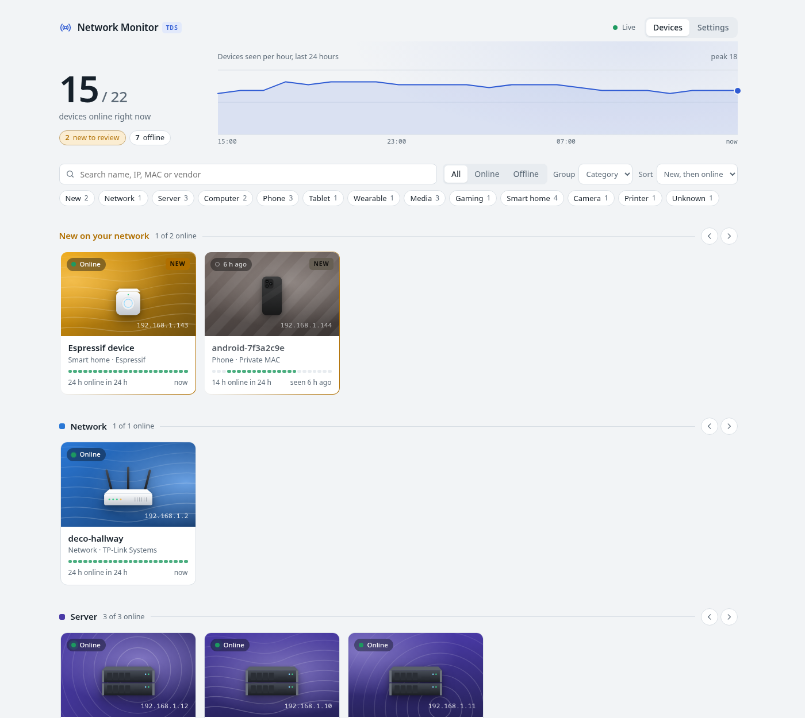
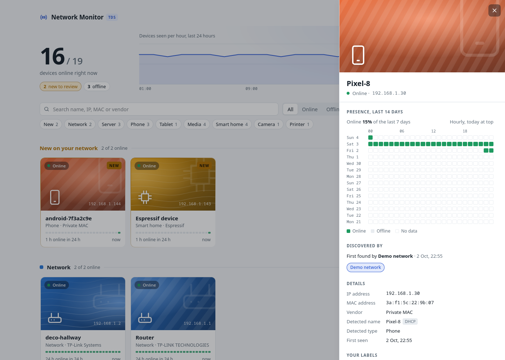

# Network Monitor TDS

**A home network monitor that doesn't suck.** *TDS* stands for *That Doesn't Suck*.

Network Monitor TDS shows every device on your network as a card in a catalogue: whether it is online right now, what it is, who made it, and when it comes and goes. It finds devices by listening to the network and by sweeping it every few minutes, learns names from DHCP and from your Technitium server, and works out a category for each device. You keep your router as a plain gateway and your DHCP and DNS where they are: the monitor only watches.




## Features

- **Device catalogue.** Every device gets generated artwork in its category's colour, its status, IP, vendor and a 24-hour activity strip. Search, filter by status, category or new devices, group into rows by category, status or vendor, and sort.
- **Live.** Cards update by themselves when devices come online, go offline or appear for the first time.
- **Device panel.** A 14-day hourly presence heatmap, which plugins found the device and what each learned, and your own name, category and icon.
- **Passive first.** New devices are noticed within seconds from their own DHCP and ARP traffic; active ARP sweeps run only every 5 minutes, so quiet phones and IoT devices are not woken up constantly.
- **Plugins.** ARP sweep, ARP listener, DHCP sniffer, offline MAC vendor lookup, Technitium DHCP leases, and a demo network. Switch them on and off and edit their settings on the Settings page, without restarting. Third-party plugins install as ordinary Python packages.
- **Simple to run.** One process, one SQLite file, automatic database upgrades with backups.



## Quick start

You need Linux, Python 3.14 and [uv](https://docs.astral.sh/uv/).

```bash
uv sync
uv run nmtds plugins enable demo   # a simulated network, no special permissions needed
uv run nmtds serve
```

Open <http://127.0.0.1:8000>. To monitor your real network, turn the demo off and give the monitor packet-capture permissions; see [Getting started](docs/public/getting-started.md).

## Documentation

- **User guide:** [docs/public](docs/public/README.md): getting started, the web interface, plugins, Technitium, presence, configuration, the command line, upgrades and backups, and writing your own plugin.
- **Design decisions:** [docs/adr](docs/adr): why the project is built the way it is, one short record per decision.
- **Vocabulary:** [GLOSSARY.md](GLOSSARY.md): what words like *sighting*, *enrichment* and *detection* mean here.
- **What's next:** [TODO.md](TODO.md): remaining work and open questions.

## Development

```bash
make qa     # lint, format, type checks and tests
```

See [DEVELOPMENT.md](DEVELOPMENT.md) for the full workflow and [AGENTS.md](AGENTS.md) for code conventions.

---

<sub>Project starter provided by [Cookie Pyrate](https://github.com/gvieralopez/cookie-pyrate). Thanks to [NetAlertX](https://github.com/netalertx/NetAlertX) for the inspiration.</sub>
