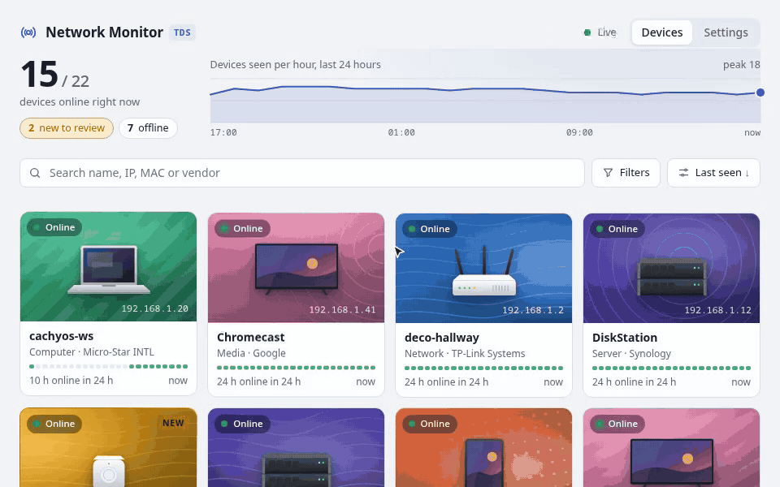

<div align="center">


# Network Monitor TDS

**A home network monitor <i>That Doesn't Suck</i>.**

[](https://github.com/gvieralopez/network-monitor-tds/actions/workflows/qa.yml)
[](https://github.com/gvieralopez/network-monitor-tds/releases/latest)
[](https://github.com/gvieralopez/network-monitor-tds/pkgs/container/network-monitor-tds)
[](https://www.python.org/)
[](LICENSE)
<br>
[](https://github.com/astral-sh/uv)
[](https://github.com/astral-sh/ruff)
[](https://mypy-lang.org/)
[](#credits)

[Quick start](#quick-start) · [Features](#features) · [Documentation](#documentation) · [Roadmap](#roadmap) · [Development](#development)

</div>

---

See every device on your network, what it is, and when it comes and goes. Devices are found by listening to the network and by regular sweeps. Each one gets a name and a category automatically.



## Features

- **Passive first.** New devices are noticed within seconds from their own DHCP and ARP traffic. Active ARP sweeps ask only devices that have gone quiet every 5 minutes, and the whole subnet every 30, so quiet phones and IoT devices are not woken up constantly.
- **Live.** Cards update by themselves when devices come online, go offline or appear for the first time.
- **Twelve categories**, worked out from hostnames, mDNS services, DHCP vendor classes and the manufacturer: network, server, computer, phone, tablet, wearable, media, gaming, smart home, camera, printer and unknown.
- **Device catalogue.** Status, IP, vendor and a 24-hour activity strip for every device. Search, filter by status, category or new devices, group into rows by category or vendor, and sort by last seen, name, IP address or first seen, either way round.
- **Device panel.** Click a card and it grows into a panel. *Overview* shows the device's details, which plugins found it and what each learned, and a 14-day hourly presence heatmap. *Manage* holds your own name and category, saved as you change them, and lets you forget a device you no longer own.
- **Drawing picker.** The pencil on a device's drawing turns the panel over to show every drawing, with those of its category recommended first and a search to find any other.
- **Plugins.** ARP sweep, ARP listener, DHCP sniffer, offline MAC vendor lookup, Technitium DHCP leases, and a demo network. Switch them on and off and edit their settings under **Settings → Sources**, without restarting. Third-party plugins install as ordinary Python packages.
- **Simple to run.** One process, one SQLite file, automatic database upgrades with backups, and a JSON API.
- **Drawings and card styles.** Every device gets a drawing of the kind of device it is. *Artwork* cards put it on a pattern in its category's colour, generated from the MAC address so no two devices look alike; *Studio* cards put it on a plain backdrop. Light and dark themes for both.

## Quick start

### Docker

```yaml
services:
  network-monitor:
    image: ghcr.io/gvieralopez/network-monitor-tds:latest
    restart: unless-stopped
    network_mode: host
    cap_add: [NET_RAW, NET_ADMIN]
    volumes:
      - nmtds-data:/data

volumes:
  nmtds-data:
```

Run `docker compose up -d` and open `http://<host>:8000`. Pin a version tag instead of `latest` so upgrades happen when you choose. Host networking and both capabilities are required; [Running in Docker](docs/public/docker.md) explains why.

### From source

You need Linux, Python 3.14 and [uv](https://docs.astral.sh/uv/).

```bash
uv sync
uv run nmtds plugins enable demo   # a simulated network, no special permissions needed
uv run nmtds serve
```

Open <http://127.0.0.1:8000>. To monitor your real network, turn the demo off and give the monitor packet-capture permissions; see [Getting started](docs/public/getting-started.md).

## Documentation

| | |
|---|---|
| **User guide** | [docs/public](docs/public/README.md): getting started, the web interface, plugins, Technitium, presence, configuration, the command line, the API, upgrades and backups, and writing your own plugin. |
| **Design decisions** | [docs/adr](docs/adr): why the project is built the way it is, one short record per decision. |
| **Device drawings** | [docs/device-drawings.md](docs/device-drawings.md): the spec every drawing follows, for adding new ones. |
| **Vocabulary** | [GLOSSARY.md](GLOSSARY.md): what words like *sighting*, *enrichment* and *detection* mean here. |

## Roadmap

- Add support for multiple languages.
- Security audit.  
- Merge duplicate devices caused by randomized MACs (same hostname or DHCP fingerprint).
- New-device alerts (channel not decided; Telegram is a candidate).
- More discovery plugins: mDNS/Bonjour, SSDP/UPnP, ping sweep, opt-in nmap port scan.

## Development

```bash
make qa     # lint, format, type checks and tests
```

See [DEVELOPMENT.md](DEVELOPMENT.md) for the full workflow and [AGENTS.md](AGENTS.md) for code conventions.

## Credits

- Built and mantained by [Gustavo Viera López](https://github.com/gvieralopez) 
- With contributions from [Jorge Morgado Vega](https://github.com/jmorgadov).
- Together with **[Claude](https://claude.com/claude-code)**, which did much of the heavy lifting.
- Started from [Cookie Pyrate](https://github.com/gvieralopez/cookie-pyrate) project template.
- Inspired by [NetAlertX](https://github.com/netalertx/NetAlertX).

## License

[MIT](LICENSE) © 2026 Gustavo Viera López
